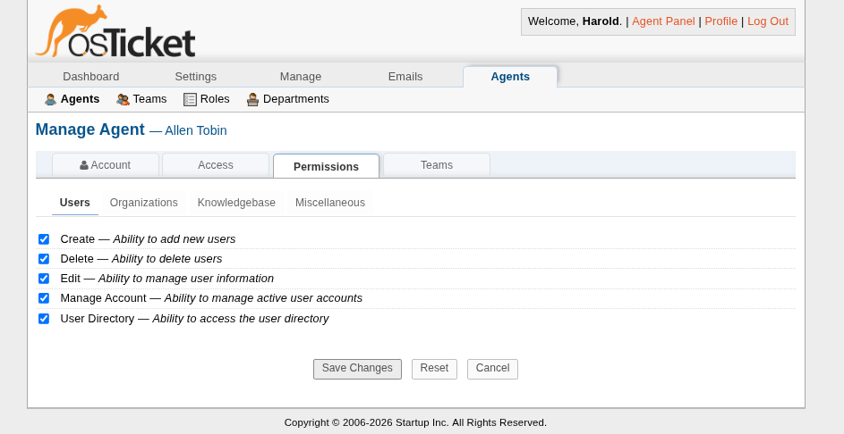
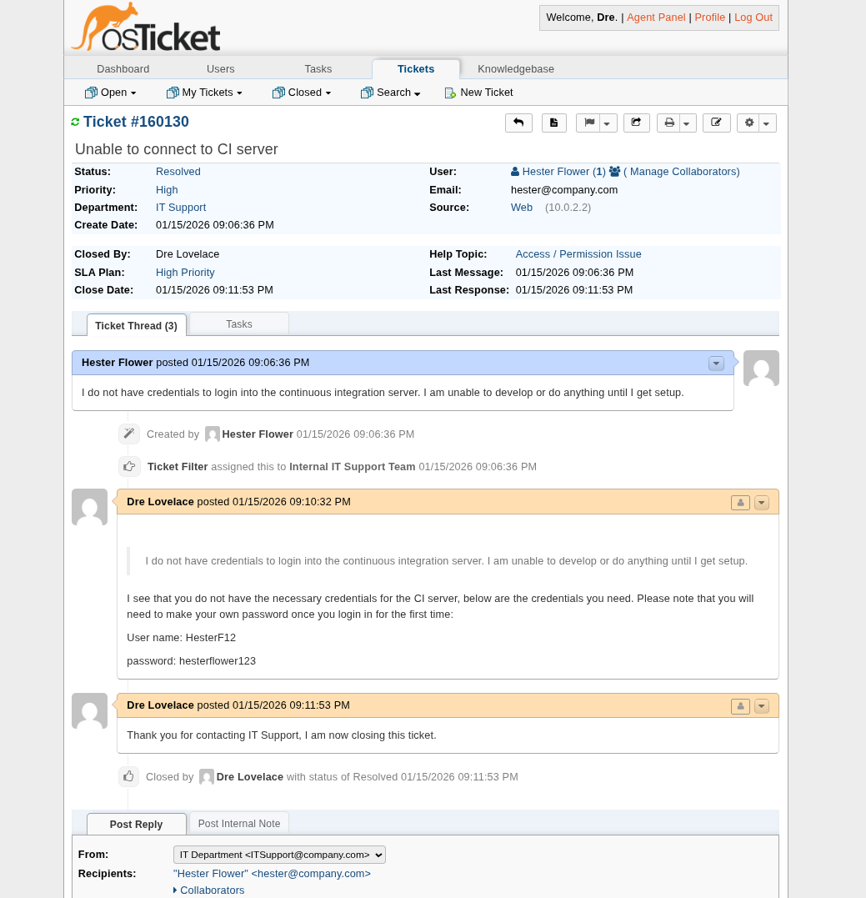
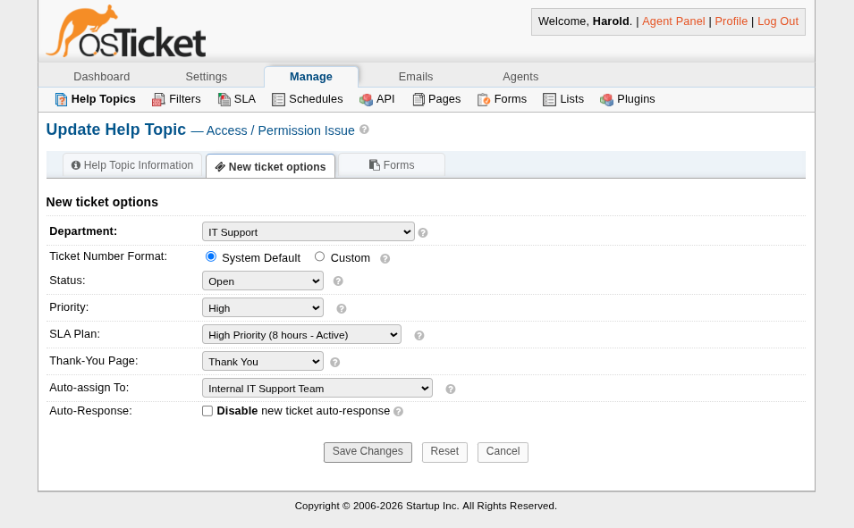

# Design Details and Setup

Here I document: 
- [Setup](https://github.com/EdibleHerald/Internal-IT-Ticketing-System-Mock-Up/blob/main/DESIGN.md#setup)
- [Agent Permissions](https://github.com/EdibleHerald/Internal-IT-Ticketing-System-Mock-Up/blob/main/DESIGN.md#agent-permissions)
- [SLAs](https://github.com/EdibleHerald/Internal-IT-Ticketing-System-Mock-Up/blob/main/DESIGN.md#service-level-agreements-slas)
- [Department-Based Ticket Routing](https://github.com/EdibleHerald/Internal-IT-Ticketing-System-Mock-Up/blob/main/DESIGN.md#department-based-ticket-routing)

## Setup

 ### Qemu Setup
 I used Qemu to create a Ubuntu Server 24.04 LTS instance. Below are some commands used. 

 ```
 # Creates a disk image for our VM to use
 qemu-img create -f qcow2 ubuntuDiskimage 50G 

 # Boots a virutal machine with 4 cores, 4GB of 
 # ram, uses a Ubuntu CDROM, and attaches a disk 
 # image that acts as its harddisk.

 # Additionally uses Host's port 8080 to output the
 # virtual machine's port 80 data, this allows the 
 # Host to access the OSTicket webpage.

 # "-display gtk" is specifically for Wayland GUIs,
 # it can be removed if unneeded 

 qemu-system-x86_64 -cdrom pathToUbuntuRomHere -boot order=d -drive file=ubuntuDiskimage,format=qcow2 -display gtk,grab-on-hover=off -m 4G -cpu max -smp 4 -netdev user,id=net0,hostfwd=tcp:127.0.0.1:8080-:80 -device virtio-net-pci,netdev=net0

 # From there, setup Ubuntu server as normal. After
 # setting up, close the virtual machine but remove # the "-cdrom" flag from the command and it should # boot up normally. 
 ```

 Note: Update system after finishing installation:
 ` sudo apt update` & `sudo apt upgrade`

 ### Install Necessary Packages
 From there, the Ubuntu Server instance needs some packages:
 
 - apache2
 - libapache2-mod-php # Apache PHP module, restart Apache2 after installation
 - mariadb-server
 - mariadb-client
 - curl
 - unzip

 All of these were downloaded using
 ` sudo apt install "packages here"`

 OSTicket's installation instructions ask for the "rewrite" module to be enabled in apache:
 `sudo a2enmod rewrite # Restart apache2 after this`

 ### Configure a Mariadb Database
 OSTicket requires a database through MySQL and an admin user for it to use during installation. 

 This is as simple as running the following 3 commands:
 ```
 CREATE USER 'user'@'localhost' IDENTIFIED BY 'password'
 CREATE DATABASE myDatabase
 GRANT ALL ON myDatabase.* TO 'user'@'localhost'
 ```
 This creates a database named "myDatabase" with admin user "user" with password "password".

 ### OSTicket installation
 Here we curl a zipped installation from the OSTicket github, unzip it, then move the OSTicket folder to /var/www/html.

 Copy the "ost-sampleconfig.php" into a new "ost-config.php" file that will serve as the configuration file for OSTicket. 

 Give it the following permissions:
 ```
 sudo chown -R www-data:www-data /var/www/html/osticket
 sudo chmod -R 755 /var/www/html/osticket
 sudo chmod 0666 /var/www/html/osticket/include/ost-config.php
 ```

 Now its simple as accessing the OSTicket site to finish setup at the loopback address at the port used when setting up the virtual machine:

 `http://127.0.0.1:8080`

 From there, its just about following on-screen instructions and setting up an admin user.

## Agent Permissions
 There are a total of 8 agents between the 3 dedicated departments that handle tickets:
 
 - Human Resources: 2 Agents
 - IT Support: 4 Agents
 - Product Development / Quality Assurance: 2 Agents

 Each department's agents get their own permissions:

 ### IT Support Department
 Managers specifically get:
 - User Creation Permissions
 - User Account Edit/Management Permissions
 - Altering Email Banlists
 - Ability to view user stats

 Below is a picture of a permission's page for one of the IT Managers:
 

 Those below managers keep the ability to view statistics but generally don't get the ability to alter or create user accounts as a security precaution. As this is for a hypothetical 30-person SaaS, it makes sense for user creation to be delegated to a higher-up in a manager role as opposed to other agents who don't need these permissions. 

 The other IT Support agents get:
 - Ability to view user statistics
 - Manage user accounts (but NOT edit them)
 - View user directory
 - View other departments

 Every single IT Support agent gets an "Expanded" primary role which allows them to open, close, edit, and assign tickets which is their main responsibility for the most part. 

 ### Human Resources and Product Development / Quality Assurance
 This is a rather short sub-section, both departments' agents get the same permissions:
 - View user directory
 - View other departments
 - Unable to manage,edit, or create user accounts
 - Ability to search through tickets

 These agents also get an "Expanded" primary role since they need to be able to open,close,edit, and assign tickets.

 Otherwise, they have limited abilities since they don't need many permissions to resolve the "simpler" ticket topics that their departments are routed. 

## Service Level Agreements (SLAs)
 There are 4 custom Service Level Ageements made in this lab:

 - High Priority (8 hours)
 - Human Resources (27 hours)
 - Quality Assurance (40 hours)
 - Short-term Issues (18 hours)

 For the two with department names, it is meant to indicate the default for tickets routed to their respective departments. 
 "High Priority" and "Short-term Issues" however, are used for more important/urgent ticket topics

 This is shown off in the demonstration within the README.md, here is a screenshot of a resolved ticket:

 

 Here we can see that the ticket submitted by "Hester Flower" has automatically be assigned "High Priority" SLA due to the ticket topic having been setup that way. This allows for easy identification of important tickets while urging agents to complete it ASAP.

 Hypothetical managers are expected to enforce these ticket SLA policies for their respective departments. 

## Department-Based Ticket Routing
 This part perhaps is the simplest, as ticket creation includes the option for routing to certain departments or teams of agents. 

 I have created a team for each department made up of each Agent assigned to that department with their respective leaders.
 These teams help make organization easier as well as provide a natural way to seperate sub-teams if the need ever arises (e.g. Startup grows into a larger organization with different teams)
 

 From there, its as easy as assigning the ticket to the team in question. Below is an image of an "Account issues" topic being configured to be routed automatically to the IT Support team.
 
 
 
