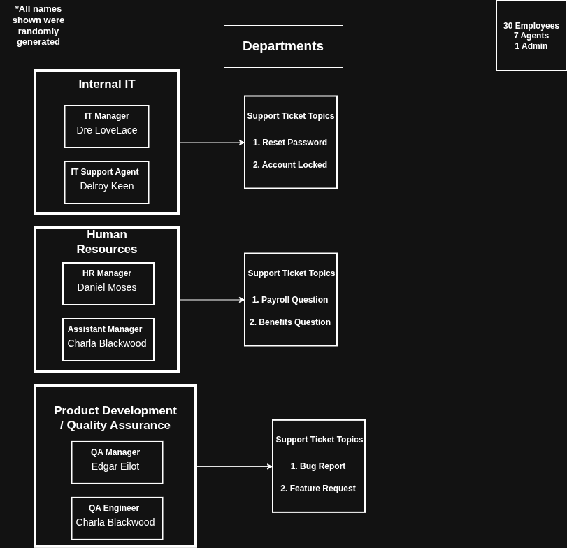

# Internal IT Ticketing System Mock Up

This project showcases an IT ticketing system using OSTicket for a hypothetical 30-person SaaS startup.

Here is a simple illustration of the main departments, their assigned agents, and the support tickets they handle.

## Project Goals and Scope
This project documents a configured OSTicket instance to support internal-only ticketing.
- Department-based ticket routing
- Agent role separation and least-privilege access configuration
- Business-hours SLA policies
- Realistic internal IT, HR, and Product/QA workflows

## Technology Stack
This project uses the following:
- Qemu, for a VM instance
- OSTicket, as the ticketing service
- Ubuntu Server 24.04.03 LTS
- Apache2, with PHP and MySQLi extensions as the webserver to host OSTicket
- MariaDB, a MySql database used by OSTicket 
