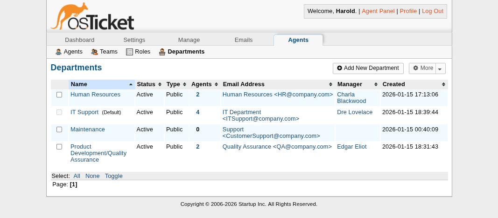
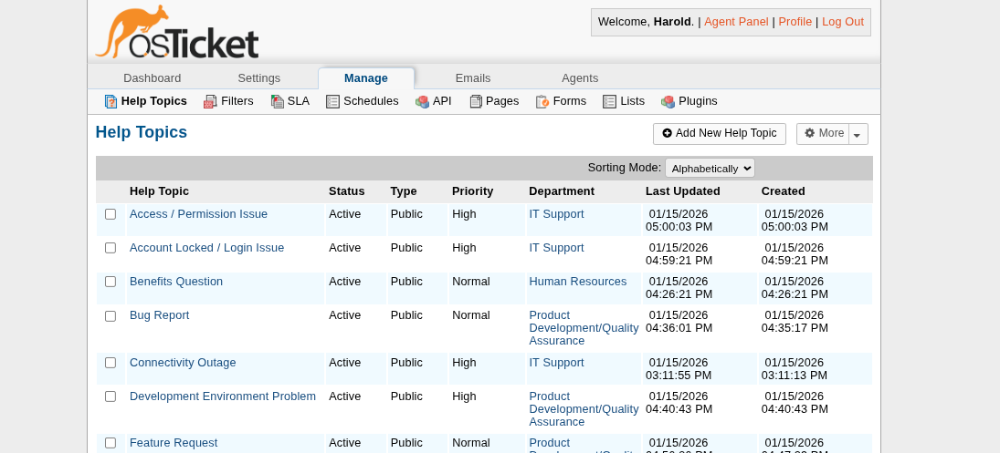
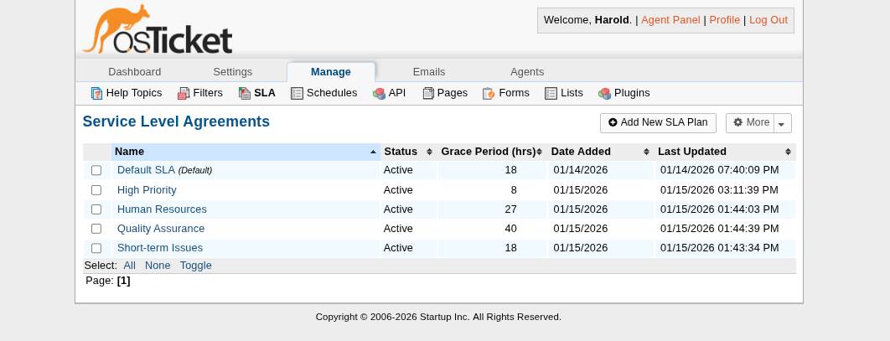

# Internal IT Ticketing System Mock Up

This project showcases an IT ticketing system using OSTicket for a hypothetical 30-person SaaS startup.

Here is a simple illustration of the main departments, their assigned agents, and the support tickets they handle.

This image is a conception overview, more details on the setup below. 

## Project Goals and Scope
This project documents a configured OSTicket instance to support internal-only ticketing.
- Department-based ticket routing
- Agent role separation and least-privilege access configuration
- Business-hours SLA policies
- Realistic internal IT, HR, and Product/QA workflows

The hypothetical organization in question is a 30-person SaaS startup.
This document serves as a brief overview, with more in-depth design decision justifications and explainations within the DESIGN.md file. 

## Technology Stack
This project uses the following:
- Qemu, for a VM instance
- OSTicket, as the ticketing service
- Ubuntu Server 24.04.03 LTS
- Apache2, with PHP and MySQLi extensions as the webserver to host OSTicket
- MariaDB, a MySql database used by OSTicket 

## Departments and Agents
Within this SaaS startup, there are 5 departments:
- *Human Resources (HR)
- *Internal IT
- *Product Development / Quality Assurance
- Sales & Marketing
- Accounting

Only the three marked (*) are given dedicated agents for tickets assigned to them. Along with Agents, each department is assigned a company email that each will recieve support ticket information at (e.g. ITSupport@company.com). 
You can consult the image for specific titles and mock names used. 
See the below image for each department and their assigned manager (Maintenance department isn't relevant). Theres also additional "teams" to match each department that aren't shown here (for organization), but aren't relevant here beyond a brief mention. 

##  Help Topics & Routing
Some ticket topics include:
- Connectivity Outage (routed to IT Support)
- Benefits Question (routed to HR)
- Payroll Question (routed to HR)
- Bug Report (routed to QA)
- Reset Password (routed to IT Support)

Each topic is routed appropriately so user-created tickets are routed to the correct departments, they are additionally notified of said ticket through their given company emails. 

Below is an image showing some of these ticket topics. 

## Service Level Agreements (SLA) and Schedules
SLAs are important to consider when it comes to how quickly agents are expected to respond. 
The general order of importance for each SLA I created goes as follows:
- High Priority (8 business hours)
- Short-Term Issues (18 business hours)
- Human Resources (27 business hours)
- Quality Assurance (40 business hours)

I gave HR and QA their own SLAs because most concerns tied to them specifically tend to either be not an emergency or takes time to resolve. 
These times are based off the Monday-Friday, 8am-5pm schedule that most departments and tickets use. The schedule I chose was meant to reflect common business hours I see with tickets only expiring during business hours, not counting federal (United States) holidays.
The below image shows off these SLAs within the admin panel. 

