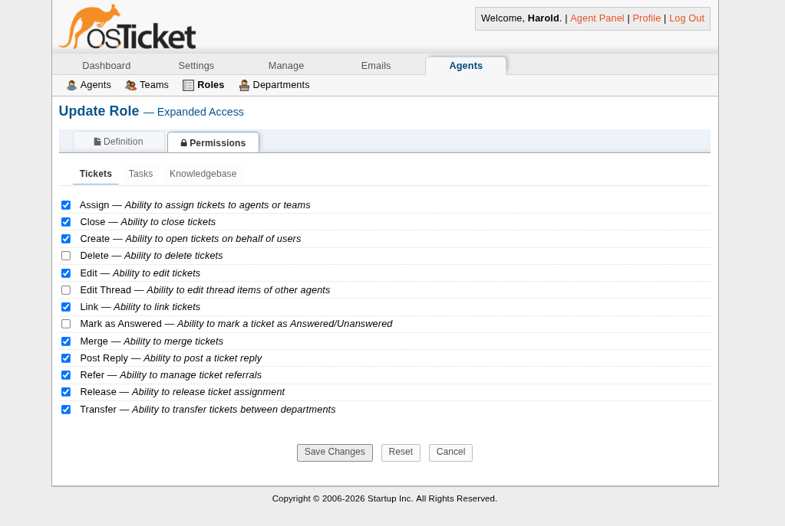
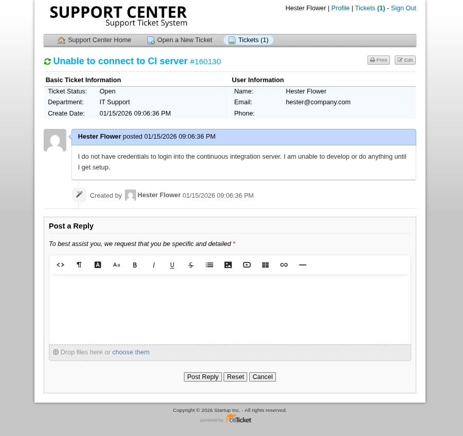
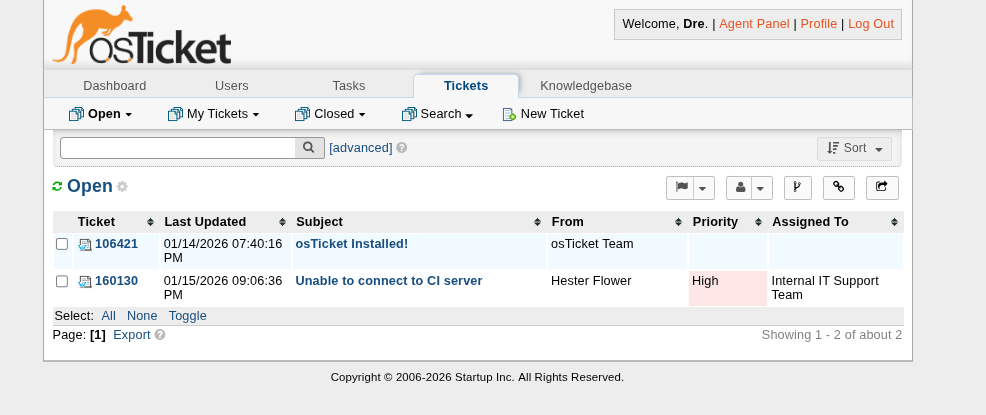
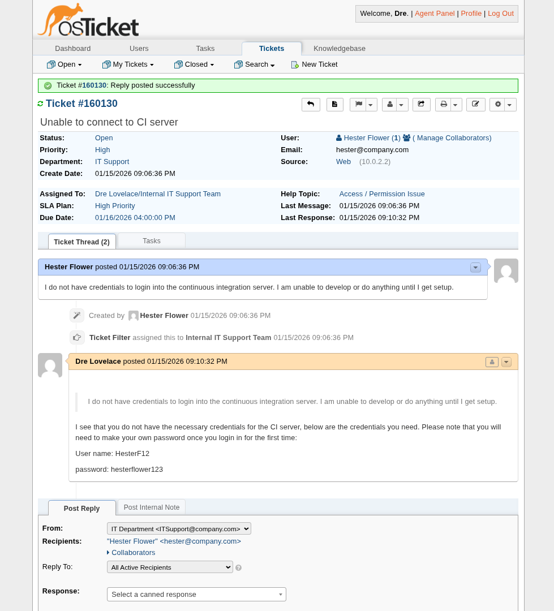

# Internal IT Ticketing System Mock Environment

This project showcases an IT ticketing system using OSTicket for a hypothetical 30-person SaaS startup.

Here is a simple illustration of the main departments, their assigned agents, and the support tickets they handle.

This image is a conception overview, more details on the setup below. 

NOTE: "Harold" (author) is the admin, meant to be a stand-in for the hypothetical IT Administrator. 

## Project Goals and Scope
This project documents a configured OSTicket instance to support internal-only ticketing.
- Department-based ticket routing
- Agent role separation and least-privilege access configuration
- Business-hours SLA policies
- Realistic internal IT, HR, and Product/QA workflows

The hypothetical organization in question is a 30-person SaaS startup.
This document serves as a brief overview, with more in-depth design decision justifications and explainations within the DESIGN.md file. 

## Technology Stack
This project uses the following:
- Qemu, for a VM instance
- OSTicket, as the ticketing service
- Ubuntu Server 24.04.03 LTS
- Apache2, with PHP and MySQLi extensions as the webserver to host OSTicket
- MariaDB, a MySql database used by OSTicket 

## Departments and Agents
Within this SaaS startup, there are 5 departments:
- *Human Resources (HR)
- *Internal IT
- *Product Development / Quality Assurance
- Sales & Marketing
- Accounting

Only the three marked (*) are given dedicated agents for tickets assigned to them. Along with Agents, each department is assigned a company email that each will recieve support ticket information at (e.g. ITSupport@company.com). 
You can consult the image for specific titles and mock names used. 
See the below image for each department and their assigned manager (Maintenance department isn't relevant). Theres also additional "teams" to match each department that aren't shown here (for organization), but aren't relevant here beyond a brief mention. 

##  Help Topics & Routing
Some ticket topics include:
- Connectivity Outage (routed to IT Support)
- Benefits Question (routed to HR)
- Payroll Question (routed to HR)
- Bug Report (routed to QA)
- Reset Password (routed to IT Support)

Each topic is routed appropriately so user-created tickets are routed to the correct departments, they are additionally notified of said ticket through their given company emails. 

Below is an image showing some of these ticket topics. 

## Service Level Agreements (SLA) and Schedules
SLAs are important to consider when it comes to how quickly agents are expected to respond. 
The general order of importance for each SLA I created goes as follows:
- High Priority (8 business hours)
- Short-Term Issues (18 business hours)
- Human Resources (27 business hours)
- Quality Assurance (40 business hours)

I gave HR and QA their own SLAs because most concerns tied to them specifically tend to either be not an emergency or takes time to resolve. 
These times are based off the Monday-Friday, 8am-5pm schedule that most departments and tickets use. The schedule I chose was meant to reflect common business hours I see with tickets only expiring during business hours, not counting federal (United States) holidays.
The below image shows off these SLAs within the admin panel. 

## Access Control and Roles
At a minimum, each agent has permissions to view users, search for tickets, and see all departments. 
However, some department agents have special permissions:
- IT Support Agents: user creation, user account management, statistics on other agents, ability to alter email banlist for effective security.
- Human Resource Agents: User account management (but no editing permissions).
- Quality Assurance: Cannot manage user accounts as its unnecessary. 

Each agent has also been given the "Expanded" primary role. This role allows agents to create, close, assign, and edit tickets as well as more. This role was chosen with the idea that these agents will be the primary handlers of their respective tickets, so they get the permissions they need to adequately manage tickets but without permissions to outright delete tickets for preservation. 

Below is an image showing the permissions of the "Expanded" role. 

## Demonstration

We will login as an employee (Hester Flower) and submit a ticket, where we will then login as an agent and resolve the relevant ticket.

First, we login as Hester Flower and submit a basic ticket about needing credentials for a CI server.

Then, the ticket is routed to the IT Support team. Looking back at who is the manager of that team, it should be Dre Lovelace. So we login into the Dre Lovelace agent account to resolve this ticket. Below is an image of the page of Dre Lovelace after logging in. Notice how the ticket was correctly labeled as "Priority: High" and correctly routed to the IT Support team. 

Here we can clearly see Hester Flower's ticket, so we review it and respond accordingly. 

Once we believe that the ticket has been resolved, the agent tags the ticket as resolved and closes it appropriately.

## Conclusion 
This is the workflow of my OSTicket instance, is it meant to be efficient, safe, and easy to understand. For more specific details on permissions, access control, and setup, please see the DESIGN.md file. 
